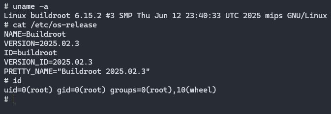

# MIPS Pwn Research Resources
During my time researching MIPS binary exploitation, I created some resources that were super helpful for me and thought I'd share publicly for everyone to use. They include:

* [60 Docker containers for cross-compiling C/C++ code](#cross-compilation-containers)
* [Static, patched, userspace versions of QEMU 9.2 that supports ASLR](#userspace-qemu-binaries)
* [60 Docker containers for emulating MIPS binaries](#emulation-containers)
* [MIPS system QEMU 9.2 binaries for kernel emulation](#system-qemu-binaries)
* [QEMU-compatible mipsel32r2 Linux kernel version 6.15.2](#linux-kernel)

## Cross-Compilation Containers
> *[See these containers on Docker Hub](https://hub.docker.com/repository/docker/legoclones/mips-compile/general)*

I created over 60 Docker containers to cross-compile C/C++ code from a 64-bit x86 machine into one of the supported MIPS architectures, avoiding installing buildroot and compiling the dependencies on your own. I support all releases of MIPS32 and MIPS64 using glibc, musl, and uClibc-ng (see all tags [on DockerHub](https://hub.docker.com/repository/docker/legoclones/mips-compile/general)).

### Usage
These containers should usually be used on the command line (and not from a Dockerfile, although I guess they can be):
```bash
docker run -it --rm -v ${PWD}:/workdir legoclones/mips-compile:<build_id> <command>
```

As an example, if you wanted to compile `file.c` in your current directory using `gcc` to make a little endian MIPS32r2 binary, you'd run:
```bash
docker run -it --rm -v ${PWD}:/workdir legoclones/mips-compile:mipsel32r2-glibc mipsel-linux-gcc file.c -o file
```

### Building
If you'd like to follow the same process to build these containers yourself, I've attached my command below. Assuming [Buildroot](https://buildroot.org/download.html) has already been downloaded, [configured, and the toolchain compiled](https://buildroot.org/downloads/manual/manual.html#_buildroot_quick_start), and assuming an existing `./docker/compiling/<build_id>/` folder exists, build the Docker container using the following command:
```bash
docker build -f docker/Dockerfile.cc . -t mips-compile:<build_id> --build-arg build=<build_id>
```

## Userspace QEMU Binaries
QEMU is a popular emulation framework that [supports various user-mod MIPS versions and releases](https://qemu-project.gitlab.io/qemu/user/main.html#other-binaries) (MIPS32 and MIPS64). However, QEMU doesn't support ASLR out-of-the-box, making it difficult to use in security-conscious contexts like CTF problems or fuzzing. Therefore, I wrote [a custom patch](./qemu/aslr.patch) for QEMU 9.2 that enables ASLR on all running binaries, using 12 bits of randomness for 32-bit binaries and 36 bits of randomness for 64-bit binaries. These QEMU binaries enable stack canaries, PIE, RELRO, and DEP.

The binaries were compiled (and can be replicated by you) inside of an `ubuntu:24.04` Docker container using the following commands:
```bash
# install dependencies
apt update
apt install -y gcc make file wget cpio unzip python3 python3-venv python3-pip git libglib2.0-dev libfdt-dev libpixman-1-dev zlib1g-dev ninja-build
pip3 install --break-system-packages sphinx sphinx_rtd_theme

# get code
cd /tmp
git clone https://github.com/qemu/qemu
cd qemu
git checkout stable-9.2

# patch for ASLR
cp qemu/aslr.patch linux-user/aslr.patch                # the aslr.patch file is custom and located in this repo
cd linux-user && patch mmap.c aslr.patch && cd ../

# build
mkdir build
cd build
../configure --target-list=mips-linux-user,mips64-linux-user,mips64el-linux-user,mipsel-linux-user,mipsn32-linux-user,mipsn32el-linux-user --static
make
```

Note that there are 6 (statically-compiled) executables resulting from this, supporting N32 and O32 ABIs on 32-bit MIPS in addition to 64-bit MIPS. They can be downloaded [from the `qemu/` folder](./qemu/):
* [`qemu-mips`](./qemu/qemu-mips) (32-bit, big endian, O32 ABI)
* [`qemu-mipsel`](./qemu/qemu-mipsel) (32-bit, little endian, O32 ABI)
* [`qemu-mips64`](./qemu/qemu-mips64) (64-bit, big endian, N64 ABI)
* [`qemu-mips64el`](./qemu/qemu-mips64el) (64-bit, little endian, N64 ABI)
* [`qemu-mipsn32`](./qemu/qemu-mipsn32) (32-bit, big endian, N32 ABI)
* [`qemu-mipsn32el`](./qemu/qemu-mipsn32el) (32-bit, little endian, N32 ABI)

*(Note - also for funzies I included a version of `qemu-mipsel` with no ASLR in the same directory)*

## Emulation Containers
> *[See these containers on Docker Hub](https://hub.docker.com/repository/docker/legoclones/mips-pwn/general)*

While the userspace QEMU binaries can emulate any cross-compiled MIPS binaries out of the box, any dynamically-compiled binaries still need the libraries present on the system, and any MIPS pwn CTF problems require a bit more work. Therefore, I created a 60 containers that embed the userspace QEMU binaries (described above) into an Ubuntu 24.04 container with the target MIPS libraries pre-installed. Just as with the cross-compilation containers, I support all releases of MIPS32/64 and the libc implementations glibc, musl, and uClibc-ng (see all tags [on DockerHub](https://hub.docker.com/repository/docker/legoclones/mips-pwn/general)).

All QEMU containers perform userspace emulation using statically-compiled QEMU with a custom patch to insert ASLR. The `/target/` directory is used as the chroot directory for emulation. The entire `output/target/` directory from the corresponding MIPS buildroot is copied over to the Docker container, along with the proper variation of QEMU as specified by Docker build arguments.

Ingress to the container is handled by (statically-compiled) socat, which handles concurrent TCP connections. It first drops privileges to an unprivileged user, then runs `/ctf/chal`. In order to handle exploits that use the `execve` syscall to call `/bin/sh`, the executables `sh`, `cat`, and `ls` are copied into the chroot environment. These 3 executables are patched and their `RPATH` is set to `/x86`, where necessary x86_64 libraries are copied. This is done so that MIPS and x86 libraries are effectively separated and all remotely-spawned processes are unprivileged.

**TL;DR**:
* QEMU is patched with ASLR
* x86 version of `sh`, `cat`, and `ls` are available for easy access in exploits
* All remotely-spawned processed are unprivileged even inside the chroot environment

### Usage
#### CTF Hosting
Challenge files are intended to be placed in `/ctf`, with the challenge binary located at `/ctf/chal`. An example Dockerfile that would import CTF-specific files into one of these QEMU containers is below:

```dockerfile
FROM legoclones/mips-pwn:<build_id>

# copy files
COPY ctf/ /target/ctf

# run
CMD ["bash", "/start.sh"]
EXPOSE 1337
```

Normally, the only two files inside the `./ctf/` folder are `chal` and `flag.txt`.

#### Running and Debugging
To simply run the executable with QEMU in an already containerized environment with the needed libraries, use the following one-liner:

```bash
docker run -it --rm -v ${PWD}:/target/ctf legoclones/mips-pwn:<build_id> chroot /target /qemu /ctf/<file_in_current_dir>
```

To spawn a remote debugging session using GDB on port 1234, use the following one-liner:
```bash
docker run -it --rm -v ${PWD}:/target/ctf -p 1234:1234 legoclones/mips-pwn:<build_id> chroot /target /qemu -g 1234 /ctf/<file_in_current_dir>
```

### Building
If you'd like to follow the same process to build these containers yourself, I've attached my command below. Assuming [Buildroot](https://buildroot.org/download.html) has already been downloaded, [configured, and the toolchain compiled](https://buildroot.org/downloads/manual/manual.html#_buildroot_quick_start), and assuming an existing `./docker/target/<build_id>/` folder exists, build the Docker container using the following command:
```bash
docker build -f docker/Dockerfile.qemu . -t legoclones/mips-pwn:<build_id> --build-arg build=<build_id> --build-arg qemu_ver=<path_to_compiled_qemu>
```

## System QEMU Binaries
In order to emulate MIPS CPUs for my own Linux kernels, I also compiled QEMU system binaries using version 9.2.

The binaries were compiled (and can be replicated by you) inside of an `ubuntu:24.04` Docker container using the following commands:
```bash
# install dependencies
apt update
apt install -y gcc make file wget cpio unzip python3 python3-venv python3-pip git libglib2.0-dev libfdt-dev libpixman-1-dev zlib1g-dev ninja-build
pip3 install --break-system-packages sphinx sphinx_rtd_theme

# get code
cd /tmp
git clone https://github.com/qemu/qemu
cd qemu
git checkout stable-9.2

# build
mkdir build
cd build
../configure --target-list=mips-softmmu,mips64-softmmu,mips64el-softmmu,mipsel-softmmu
make
```

There are 4 (dynamically-linked) binaries resulting from this:
* [`qemu-system-mips`](./qemu/qemu-system-mips) (32-bit, big endian)
* [`qemu-system-mipsel`](./qemu/qemu-system-mipsel) (32-bit, little endian)
* [`qemu-system-mips64`](./qemu/qemu-system-mips64) (64-bit, big endian)
* [`qemu-system-mips64el`](./qemu/qemu-system-mips64el) (64-bit, little endian)

*(Note - for some reason, my machine would occasionally complain that files like `efi-pcnet.rom` weren't available, so I copied those into a [`roms/`](./qemu/roms/) folder. If you run into the same issue, just have that file in the current directory and you should be good to go)*

## Linux Kernel
I wanted my own Linux kernel in MIPS that wasn't decades old to use in some research, so I compiled my own mipsel32r2 Linux version 6.15.2 kernel that can be successfully emulated by QEMU system binaries and a rootfs from Buildroot.

### Building the Linux Kernel
> [`vmlinux`](./kernel/vmlinux) and [`vmlinuz`](./kernel/vmlinuz)

I copied the latest kernel version (6.15.2 at the time) to my machine and use a pre-defined kernel config for the Malta board (`malta_defconfig`) inside of my `legoclones/mips-compile:latest` Docker container:
```bash
# set options to cross-compile
export ARCH=mips
export CROSS_COMPILE=mipsel-linux-

# set up
cd /tmp
apt update
apt install -y wget git fakeroot build-essential ncurses-dev xz-utils libssl-dev bc flex libelf-dev bison u-boot-tools
tar -xf linux-6.15.2.tar.xz

# compile
cd linux-6.15.2
make malta_defconfig
make -j$(nproc)
```

Linux has SEVERAL configurations for MIPS kernels right out of the gate (see `make help`), but the Malta board seems to have the best support in QEMU so I chose that profile. Note that you can further customize options if you wish by running `make menuconfig`.

### Creating the rootfs
> [`rootfs.cpio`](./kernel/rootfs.cpio)

In addition to the QEMU emulator and kernel, a root filesystem is needed so there's something to run once the kernel is up. The containers above were built using [Buildroot](https://buildroot.org/download.html), so I made sure to also create a `cpio` image when [compiling](https://buildroot.org/downloads/manual/manual.html#_buildroot_quick_start) for `mipsel32r2-glibc` (and found it in `output/images/`).

### Kernel Emulation
Once you have the [QEMU system binary](./qemu/), the [kernel `vmlinux`](./kernel/vmlinux) (or [`vmlinuz`](./kernel/vmlinuz)), and the [rootfs](./kernel/rootfs.cpio), you can emulate the system with the following command:
```bash
./qemu/qemu-system-mipsel -M malta -kernel ./kernel/vmlinux -nographic -m 256M -append "console=ttyS0" -initrd ./kernel/rootfs.cpio
```


